### PROJECT URL - __*https://stream-mate-org.netlify.app*__

# __*Stream Mate*__
__Stream Mate__ is an automated platform for __Movies__, __TV shows__, and __TV channels__. In it, users can not only watch any movies and TV shows but also add them by simply entering the desired movie/show in the -__"order" section.__ In addition to the full automation of this process and the actual watching of movies, TV shows, and TV channels, __Stream Mate also has a social aspect.__ Users can __send friendship__ invitations to other users, __chat with their friends__, __make video or audio calls send photos, search for other users, view their profiles, and share pictures.__

## - Public Area

__*Discover Page*__ - a page accessible to all registered and unregistered users. At the top, there's a Live Wallpaper section that displays a different Live Wallpaper Video of a popular game with each page refresh, or allows users to change the wallpaper using the arrows (left or right). Further down, it showcases what benefits users would receive if they register.

### __*Discover Page:*__

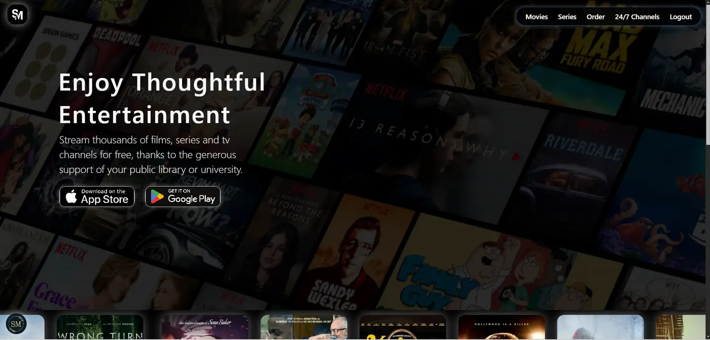

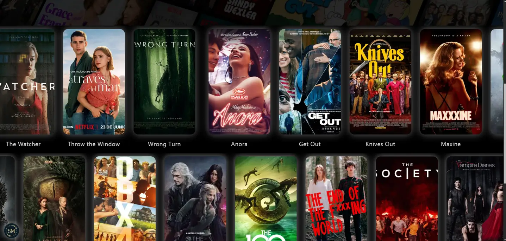

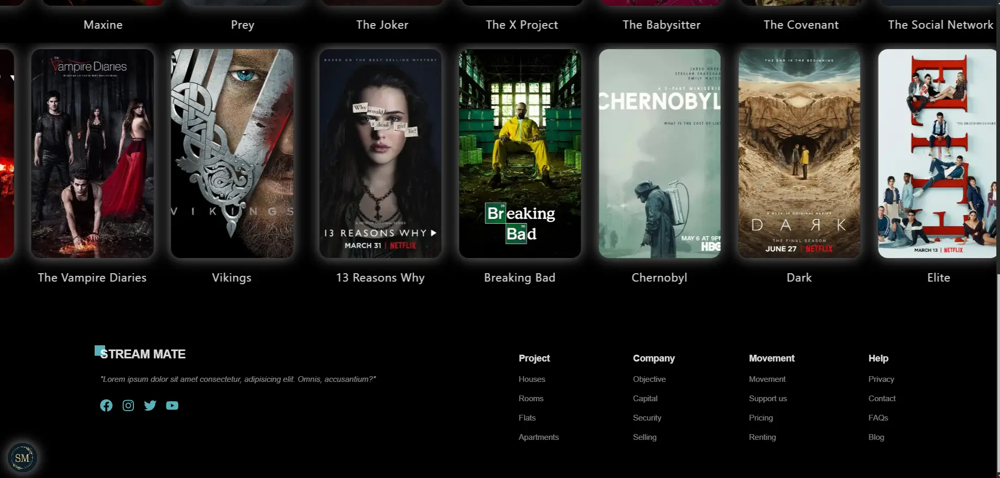

## - Private Area

### __*Cinema Records Page/Movies Page/Series Page:*__

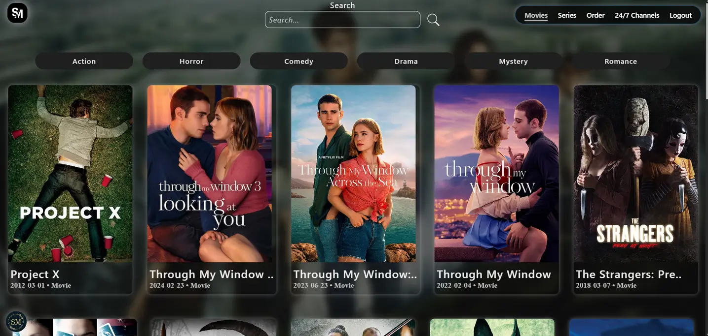

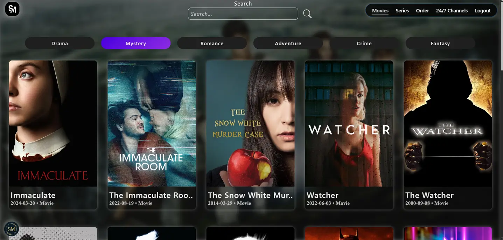

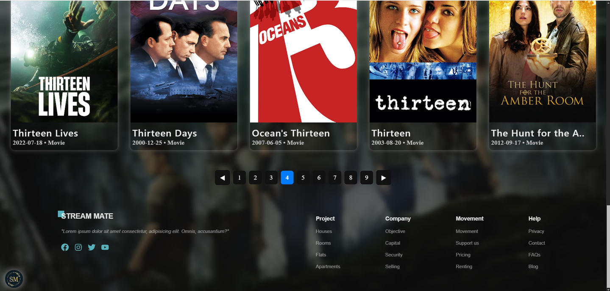

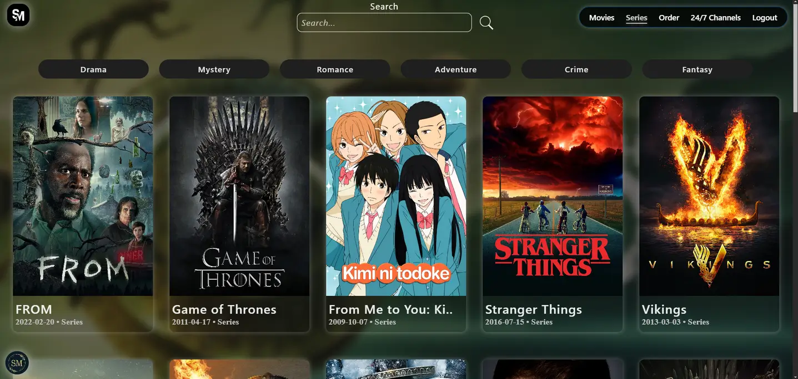

### __*Cinema Record Details:*__

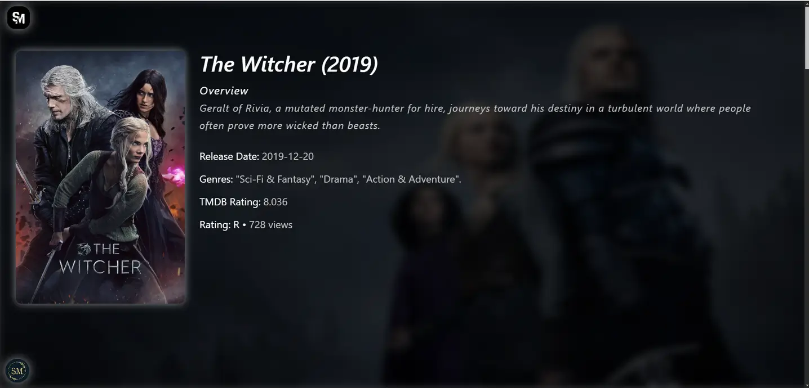

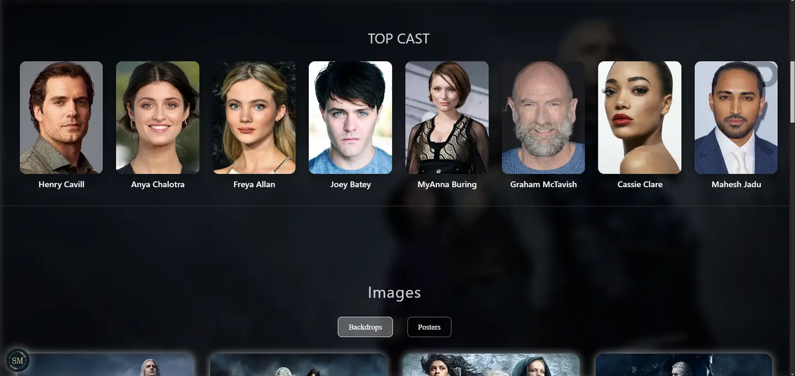

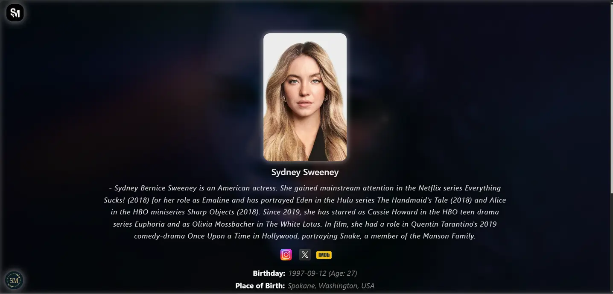

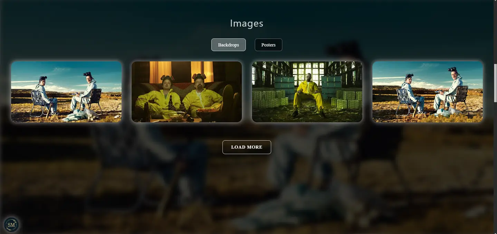

