### __*PROJECT URL*__ - __*https://stream-mate-org.netlify.app*__
### __*PRESENTATION VIDEO*__ - __*https://www.linkedin.com/feed/update/urn:li:activity:7312307756802228224*__

--

#   __*Stream Mate*__ 

### 🛠 Tech Stack
- **Back-End:**  __*Spring, PostgreSQL, Redis, Spring Security.*__
- **Front-End:**  __*React + TypeScript.*__
- **Deployment:**  __*Docker (Dockerfile + Koyeb).*__
- **Architecture:**  __*Microservices.*__
- **Real-Time Communication:**  __*WebSocket, Agora SDK.*__
- **Database:**  __*3× Aiven Cloud PostgreSQL (5GB each).*__

---

## 🎬 About Stream Mate  
Stream Mate is an automated platform for Movies, TV Shows, and TV Channels. Users can:  
✅ **Watch and add** movies/shows through an automated **"Order"** system.  
✅ **Enjoy real-time streaming** with **WebSocket** support.  
✅ **Connect socially** – send **friendship requests**, chat, and make **video/audio calls** with **Agora**.  
✅ **Share images**, search for users, and explore their profiles.
✅ **Leave comments** and discuss movies and TV shows with other users.
✅ **Watch live TV channels** such as:  
   - DAZN 1  
   - ESPN USA  
   - Nova TV  
   - BTV, BTV Action  
   - MAX SPORT 1, 2, 3, 4  
   - Ring  

---

## 🔌 Integrations & Features  
🚀 **WebSocket** for real-time messaging and calls.  
🎥 **Agora SDK** for high-quality video and audio calls.  
🔄 **Microservices Architecture** for scalability and modular development.  
🔗 **TMDB API + VidSrc** for fetching movie/show data and storing it in the database.  
💾 **3× Aiven Cloud PostgreSQL instances (5GB each)** for optimized database performance.  
🗄 **Redis** for session storage and JWT authentication.
🔐 **Spring Security** for authentication and authorization.  

# 🌍 Public Area

## 🏠 Discover Page  
A page accessible to all registered and unregistered users.  

- 🎁 **Why Register?** – Highlights the benefits of registration for unregistered users.  

### 🔹 Discover Page Preview  
  
  
  

---

# 🔐 Private Area

## 🎬 Cinema Records / Movies / Series Page  
- Browse, search, and explore movies & series in an **interactive catalog**.  
- Access detailed information, trailers, and user reviews.  

### 🔹 Movies & Series Page Preview  
  
  
  
  

---

## 🎞 Cinema Record Details  
- View **movie/series descriptions, cast, pictures, ratings**, and related content.  
- **Add comments** and discuss with other users.  

### 🔹 Cinema Record Details Preview  
  
  
  
  
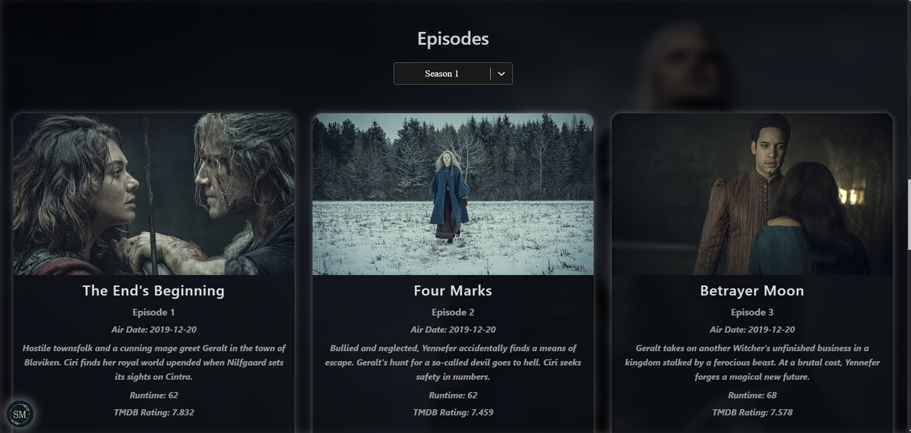  
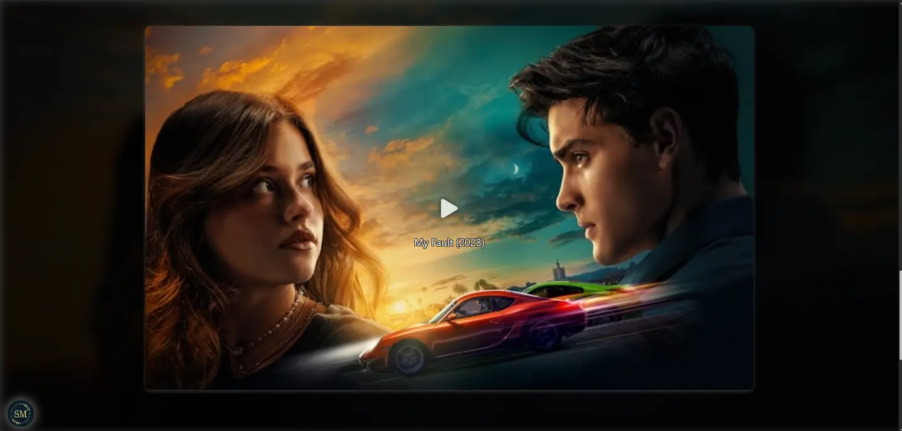  
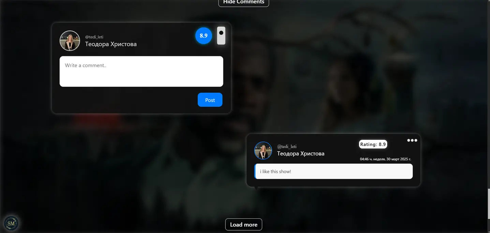  

---

## 🎟 Order Cinema Record  
- Users can **request** a movie/TV show, which will be automatically added.  

### 🔹 Order Page Preview  
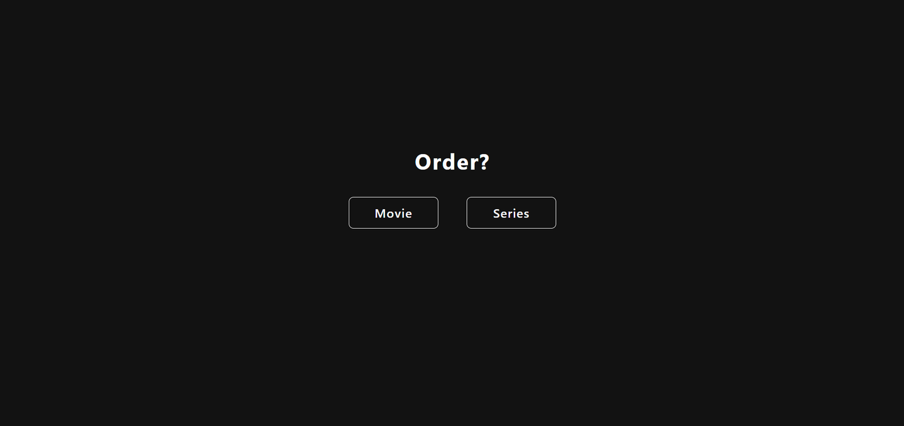  
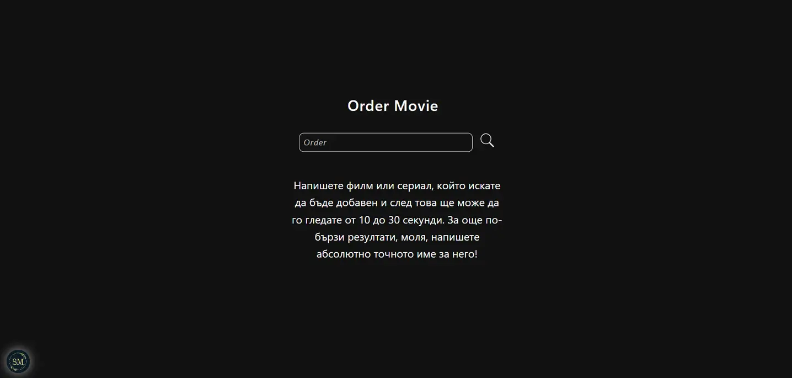  

---

## 💬 Chat & Video Chat  
- **Text chat, video & audio calls** powered by **Agora**.  
- **WebSocket-based real-time messaging**.  

### 🔹 Chat & Video Chat Preview  
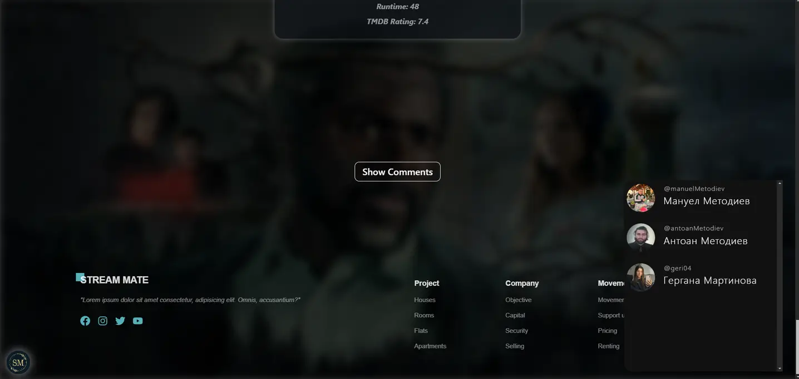  
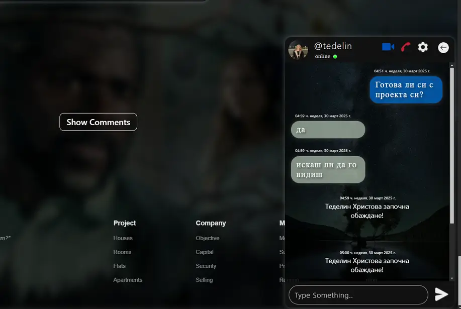  
  
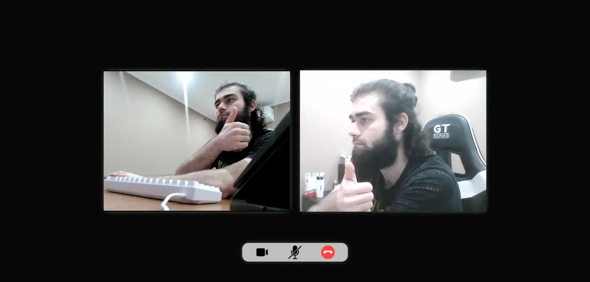  

---

## 👤 User Details & Profile Editing  
- View and edit personal profiles.  
- Upload profile pictures and manage settings.  

### 🔹 User Profile Preview  
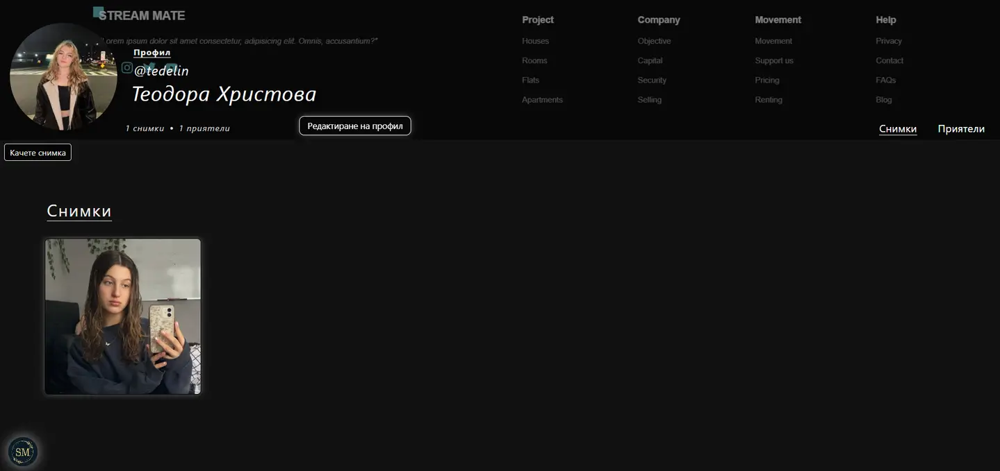  
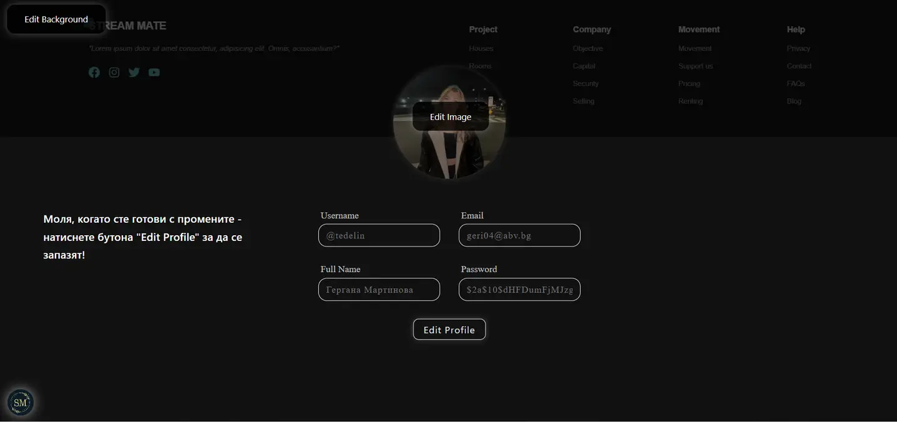  
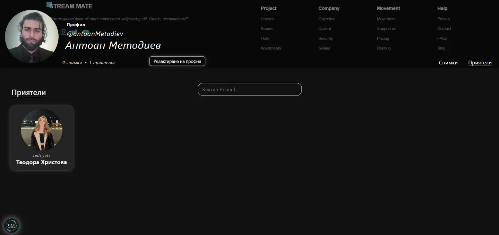  

---

## 🤝 Requests, Friends, and User Search  
- Send/accept **friend requests**.  
- Search for users and explore profiles.  

### 🔹 Friends & Search Preview  
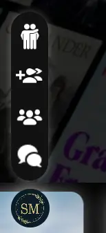  
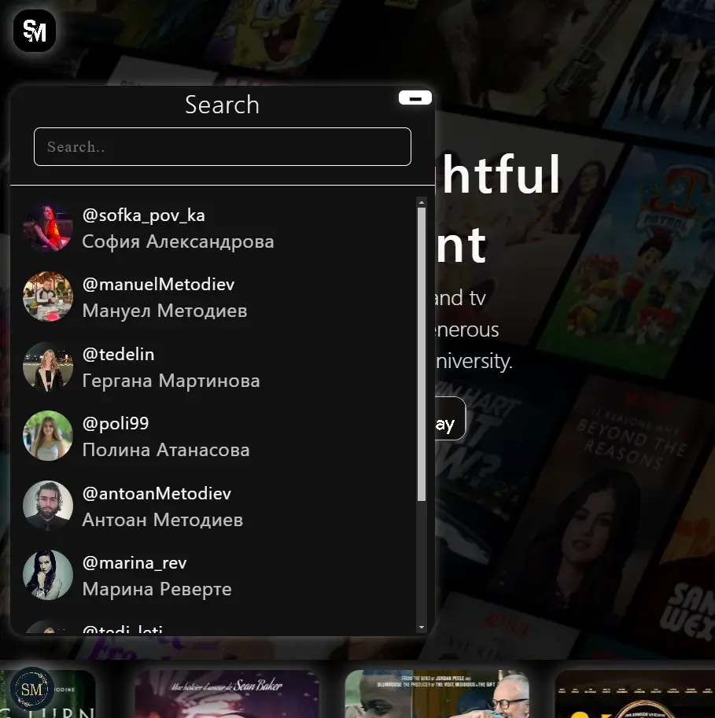  
  
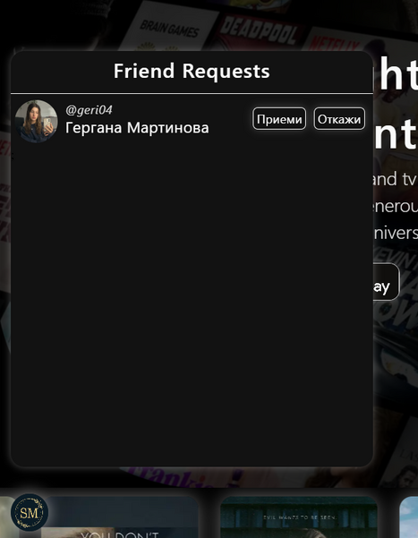  

---

## 📺 24/7 TV Channels  
- Watch **live TV channels** including:  
  🎥 **DAZN 1, ESPN USA, Nova TV, BTV, BTV Action, MAX SPORT 1, 2, 3, 4, Ring**  

### 🔹 TV Channels Preview  
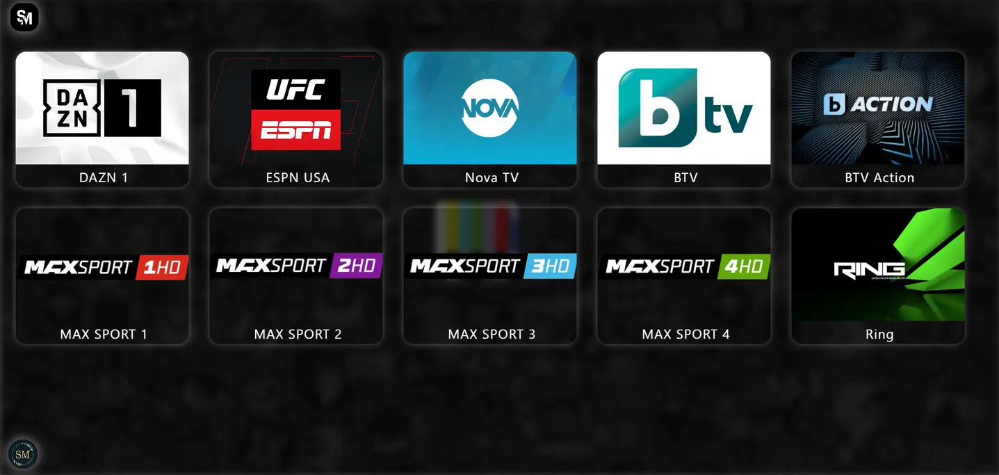  
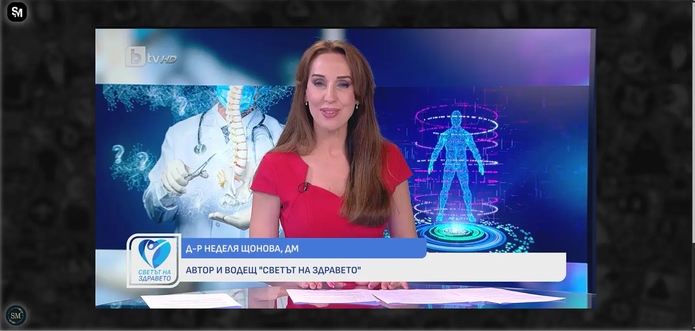
